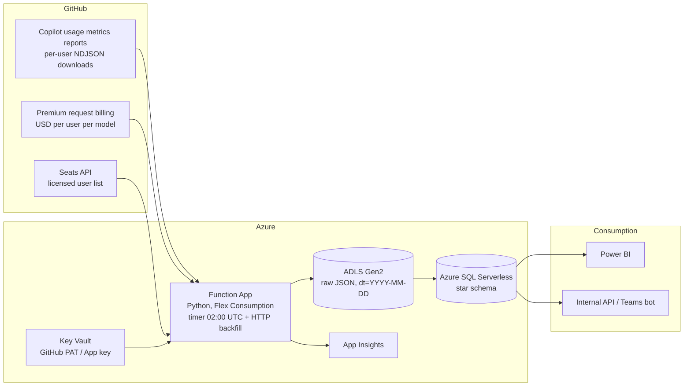

# GitHub Copilot Metrics & Spend Accelerator

Per-user, per-model, per-surface visibility into GitHub Copilot consumption and cost.

GitHub's native reporting tells you *what your enterprise spent*. This accelerator tells you:

> **Jimmy** used **$50** of **GPT-5.3** in **VS Code chat**, **$30** of **GPT-5.6** in **VS Code agents**, and **$20** of **GPT-5.4** in **Visual Studio**.

Deploy it with a single `azd up`, point it at your enterprise, and connect Power BI.

---

## Read this first — what is exact and what is modelled

| Dimension | Accuracy | Source |
|---|---|---|
| User × model × **$** | **Exact** | Premium request billing report, filtered per user |
| User × IDE activity | **Exact** | Per-user metrics report, `totals_by_ide` |
| User × model × feature activity | **Exact** | Per-user metrics report, `totals_by_model_feature` |
| User × team | **Exact, but partial** | User-teams report — GitHub omits teams under 5 seats |
| User × model × **editor** × $ | **Modelled** | Combination of the above |

GitHub publishes per-user IDE activity and per-user model/feature activity as **sibling arrays**,
never as an IDE × model cross-product. So while every input is per-user and exact, splitting a
specific model's dollars across editors still requires an assumption:

```
allocated $ = exact $(user, day, model)
            × ide_share(user, day)          -- from that user's own IDE activity
            × feature_share(user, day, model) -- from that user's own model/feature activity
```

**Per-user and per-model dollars are exact. The editor split is an estimate derived from that
individual's own behaviour** — not from a team or org average. The `attribution_quality` and
`weight_basis` columns on `vw_spend_by_user_model_editor` mark every row, and
`vw_spend_by_user_model` gives you exact figures with no modelling at all.

> **Status: unverified against a live tenant.** The code targets GitHub's documented schema but has
> not yet been run against a real enterprise. Run the validation script below before trusting output.

---

## Architecture



The API and Teams bot run inside the same Function App as the ingestion, so they add no
infrastructure and no extra cost.

### Why each piece exists

| Component | Why it is required |
|---|---|
| **Copilot usage metrics reports** | The only source with per-user IDE and model/feature breakdowns. Returns pre-signed NDJSON download links rather than inline JSON. |
| **Premium request billing** | The only source with dollar amounts. Attributable per user only when filtered with `user=`. |
| **Seats API** | Authoritative list of licensed users, which drives the billing fan-out. |
| **Function App (Flex Consumption)** | Handles report downloads, per-user billing fan-out, retries, and the metrics-to-billing join. Scales to zero. |
| **ADLS Gen2 raw zone** | Immutable archive so the warehouse can be rebuilt after a transform bug without re-querying GitHub. |
| **Azure SQL Serverless** | Star schema fits the `user × model × surface × time × $` question; T-SQL expresses the allocation cleanly. Auto-pauses when idle. |
| **Key Vault + Managed Identity** | No credentials in code, app settings, or source control. |

### Data retention

Metrics reports are available from 10 October 2025 and retain roughly **1 year**; billing retains
**24 months**. The raw zone still matters — it makes loads replayable after a transform bug — but
GitHub is not about to drop your history in 28 days.

---

## Cost profile

| Resource | Typical monthly cost |
|---|---|
| Function App (Flex Consumption) | ~$0 — well inside the free grant at this volume |
| ADLS Gen2 | Pennies |
| Azure SQL (GP_S_Gen5, auto-pause) | $5–15 |
| Key Vault + App Insights | ~$1–3 |
| **Total** | **~$10–20/month** |

---

## Prerequisites

- Azure subscription with Contributor + User Access Administrator
- [Azure Developer CLI](https://aka.ms/azd), [Azure CLI](https://aka.ms/azcli), Python 3.11, and `sqlcmd`
- The **"Copilot usage metrics"** enterprise policy set to *Enabled everywhere*, or the report
  endpoints return nothing
- A GitHub PAT or GitHub App with:
  - `read:org` and the *View Organization Copilot Metrics* permission
  - Organization admin or billing manager, for premium request usage

---

## Step 0 — Validate your GitHub access first

Before deploying anything, confirm the endpoints work for your token. The script is read-only,
needs no Azure resources, and redacts logins and amounts so the output is safe to share.

```bash
export GITHUB_TOKEN=...        # export it; never pass a token as an argument
python scripts/validate_github_api.py --org my-org
```

It probes every endpoint the ingestion uses and reports whether the fields the code reads are
actually present. Exit code 0 means you are clear to deploy. Add `--show-values` only when running
against your own account.

---

## Deploy

```bash
git clone <your-fork-url>
cd github-copilot-metrics-accelerator

azd auth login
azd env new copilot-metrics

# Entra admin for Azure SQL (no SQL passwords exist in this template)
azd env set AZURE_PRINCIPAL_ID   "$(az ad signed-in-user show --query id -o tsv)"
azd env set AZURE_PRINCIPAL_NAME "$(az ad signed-in-user show --query displayName -o tsv)"
# Deploying from CI with a service principal? Also set:
# azd env set AZURE_PRINCIPAL_TYPE Application

# GitHub scope. GITHUB_ORGS is required: both metrics and billing are pulled per org.
azd env set GITHUB_ENTERPRISE "your-enterprise-slug"
azd env set GITHUB_ORGS       "org-one,org-two"

azd up
```

`azd up` provisions everything and the postprovision hook applies `sql/01`–`05`.

### Store the GitHub credential

```bash
az keyvault secret set \
  --vault-name "$(azd env get-value AZURE_KEY_VAULT_NAME)" \
  --name github-credential \
  --value "<your-PAT>"
```

Using a GitHub App instead of a PAT? Store the PEM private key as the secret value and set:

```bash
azd env set GITHUB_APP_ID "123456"
azd env set GITHUB_APP_INSTALLATION_ID "7891011"
azd up
```

### Seed history

```bash
FUNC=$(azd env get-value FUNCTION_APP_NAME)
KEY=$(az functionapp keys list -g "$(azd env get-value AZURE_RESOURCE_GROUP)" -n "$FUNC" --query functionKeys.default -o tsv)

curl -X POST "https://$FUNC.azurewebsites.net/api/backfill?code=$KEY" \
  -H 'Content-Type: application/json' \
  -d '{"since":"2026-08-01","until":"2026-08-28"}'
```

After this, the timer runs daily at 02:00 UTC and reloads a trailing 7-day window so GitHub's
billing corrections are picked up automatically.

---

## Query it

```sql
-- The headline question
SELECT user_login, model_name, editor_family, feature,
       SUM(allocated_net_amount) AS spend
FROM dbo.vw_spend_by_user_model_editor
WHERE year_month = '2026-08' AND user_login = 'jimmy'
GROUP BY user_login, model_name, editor_family, feature
ORDER BY spend DESC;
```

```sql
-- Exact spend, no modelling
SELECT user_login, model_name, SUM(net_amount) AS spend
FROM dbo.vw_spend_by_user_model
WHERE year_month = '2026-08'
GROUP BY user_login, model_name
ORDER BY spend DESC;
```

```sql
-- Seats paying for nothing
SELECT * FROM dbo.vw_inactive_seats ORDER BY days_since_activity DESC;
```

| View | Purpose |
|---|---|
| `vw_spend_by_user_model_editor` | Headline view — spend allocated across editors and features |
| `vw_spend_by_user_model` | Exact spend, no allocation |
| `vw_spend_by_team` | Team rollup via GitHub's user-teams report |
| `vw_monthly_spend_by_team` | Cost-center chargeback rollup |
| `vw_editor_mix` | Per-user IDE activity and acceptance rate |
| `vw_model_feature_mix` | Model and feature mix per user |
| `vw_inactive_seats` | Seat reclamation candidates |

---

## Consume it

### Power BI

[powerbi/](powerbi/) ships Power Query scripts, every DAX measure, and a build guide for a
four-page report. Connect in **DirectQuery** to keep the serverless tier cheap, or **Import** with
a refresh scheduled after 03:00 UTC.

### Internal REST API

Runs in the same Function App — no extra infrastructure.

```bash
curl -s "$BASE/spend/user?login=jimmy&since=2026-08-01&until=2026-08-31&code=$KEY" | jq
```

| Endpoint | Returns |
|---|---|
| `GET /api/spend/user` | Exact total + allocated breakdown for one user |
| `GET /api/spend/team` | Per-user spend for a cost center |
| `GET /api/spend/top` | Highest spenders |
| `GET /api/spend/summary` | Enterprise totals |
| `GET /api/spend/editors` | Allocated spend by editor and feature |
| `GET /api/health` | Data freshness (no key required) |

### Teams bot

```
@Copilot Spend jimmy
@Copilot Spend top 10
@Copilot Spend team Platform
```

Implemented as a Teams Outgoing Webhook — no Azure Bot Service, no app registration. Requests are
authenticated by HMAC signature.

See [docs/api-and-bot.md](docs/api-and-bot.md) for setup.

---

## Repository layout

```
infra/            Bicep — main.bicep plus core/ modules
src/functions/    Python Function App (ingestion + API + Teams bot)
sql/              Schema, staging, MERGE procedures, views, grants
powerbi/          Power Query, DAX measures, report build guide
scripts/          GitHub API validation + post-provision database setup
docs/             Architecture, operations, API/bot, customization
.azure/           azd deployment plan
```

---

## Customize

- **Cost centers** — populate `dim_user.cost_center`, or join to your HR/CMDB source.
- **Allocation weighting** — the editor split lives in one place, `dbo.sp_build_user_ide_share`.
- **Billing cost** — per-user billing costs one request per user per period. Set
  `BILLING_GRANULARITY=month` to cut request volume ~30× at the cost of daily precision.
- **Retention** — the raw zone tiers to cool at 90 days and archive at 365; it never auto-deletes.
- **Schedule** — `azd env set INGESTION_SCHEDULE "0 0 */6 * * *"` for a 6-hourly pull.

See [docs/customization.md](docs/customization.md).

---

## License

MIT. See [LICENSE](LICENSE).
